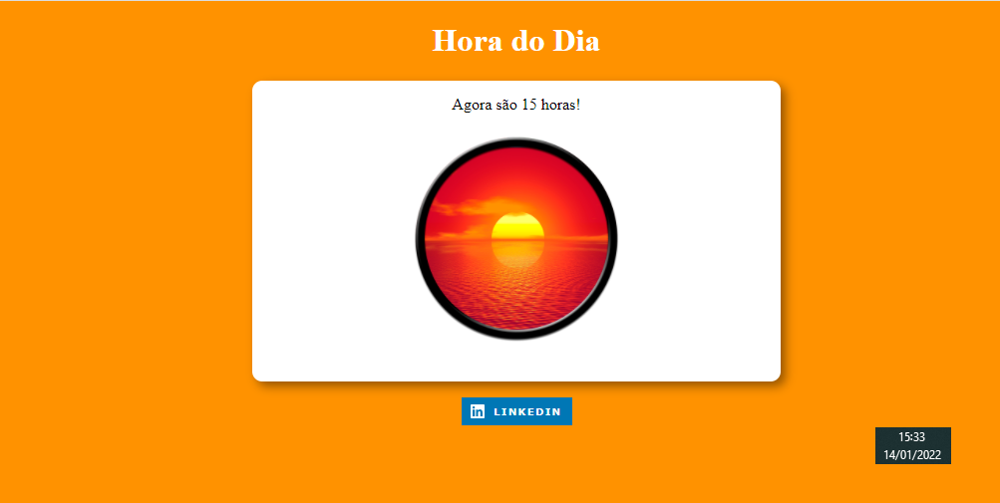

# Projeto saudação ✌

Projeto desenvolvido durante estudos pelo Curso de JavaScript do <a href="https://www.youtube.com/channel/UCrWvhVmt0Qac3HgsjQK62FQ" target="_blank">Curso em Vídeo</a>

#### 📌 Estudo de:
- HTML
- CSS
- JavaScript

#### 📌 Visualização do projeto:

